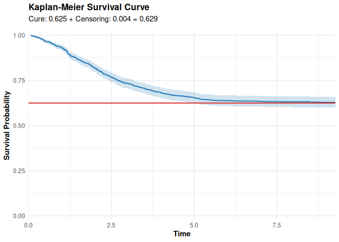
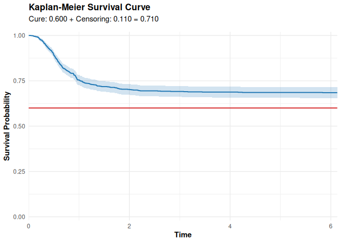
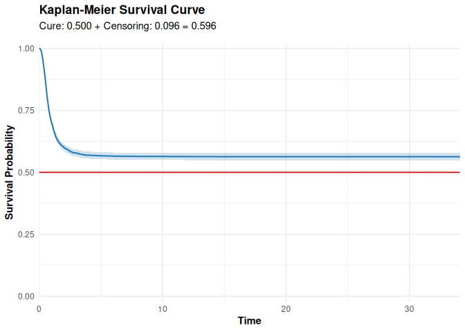

# RandomCure

No arquivo `random_with_cure.R` estão implementadas duas funções:

- `random_cure()`: gera dados de sobrevivência com cura aleatória. Nela
  não é preciso conhecer a função quantílica, podendo apenas ser
  informado a função de distribuição acumulada do modelo de
  sobrevivência com fração de cura;
- `plot_kaplan()`: constrói o gráfico de Kaplan-Meier de uma forma
  fácil, bastando passar os dados e a cura.

Segue abaixo um exemplo de uso:

``` r
library(rlang)
library(tibble)
library(dplyr)
library(survival)
library(purrr)

rm(list = ls())

# Exemplo 4 (Dagum especificando quantílica e outra distribuição para a censura)
q_dagum <- function(u, theta, alpha, beta) {
  ((u * theta) / (beta * (theta - u)))^(1 / alpha)
}

surv_dagum <- function(t, theta, beta, alpha) {
  1 - theta * beta / (beta + theta * t^(-alpha))
}

theta <- 0.5
beta <- 1.2
alpha <- 2.5

n <- 5000L
surv <- surv_dagum
quantile_function <- q_dagum
censoring_cdf <- pweibull
args_censoring_cdf <- list(shape = 2.5, scale = 2.3)
args_model <- c(theta = theta, beta = beta, alpha = alpha)
prop_zeros <- 0.6

library(ggplot2)
library(survival)

plot_kaplan <- function(
  dados,
  surv,
  title = "Kaplan-Meier Survival Curve",
  xlab = "Time",
  ylab = "Survival Probability",
  color = "#1F77B4",
  ci_color = "#1F77B4",
  cure_color = "#D62728",
  base_size = 11,
  ci_alpha = 0.2,
  line_size = 0.7,
  show_cure = TRUE,
  cure_label = "Cure: ",
  censoring_label = "Censoring: ",
  ...
) {
  # Teórica fração de cura
  cure_prob <- surv(.Machine$double.xmax, ...)

  # Proporções de censura
  total_censored <- mean(dados$delta == 0)
  additional_censoring <- total_censored - cure_prob

  # Ajuste Kaplan-Meier
  dados_surv <- Surv(time = dados$t, event = dados$delta)
  km_fit <- survfit(dados_surv ~ 1)

  # Dados da curva
  km_data <- data.frame(
    time = km_fit$time,
    surv = km_fit$surv,
    upper = km_fit$upper,
    lower = km_fit$lower
  )

  # Remove queda final artificial, se necessário
  if (tail(km_data$surv, 1) < cure_prob) {
    km_data <- km_data[-nrow(km_data), ]
  }

  max_time <- max(km_data$time)

  # Subtítulo informativo
  plot_subtitle <- if (show_cure) {
    bquote(
      .(cure_label) * .(sprintf("%.3f", abs(cure_prob))) ~ "+" ~
        .(censoring_label) * .(sprintf("%.3f", abs(additional_censoring))) ~
        "=" ~
        .(sprintf("%.3f", total_censored))
    )
  }

  # Construção do gráfico
  p <- ggplot(km_data, aes(x = time)) +
    geom_ribbon(
      aes(ymin = lower, ymax = upper),
      fill = ci_color,
      alpha = ci_alpha
    ) +
    geom_step(aes(y = surv), color = color, linewidth = line_size) +
    scale_y_continuous(limits = c(0, 1), expand = c(0, 0.02)) +
    scale_x_continuous(expand = expansion(mult = c(0, 0.05))) +
    labs(
      x = xlab,
      y = ylab,
      title = title,
      subtitle = plot_subtitle
    ) +
    theme_minimal(base_size = base_size) +
    theme(
      plot.title = element_text(face = "bold", hjust = 0, size = base_size + 2),
      plot.subtitle = element_text(
        face = "bold",
        hjust = 0,
        color = "black",
        size = base_size,
        margin = margin(b = 10)
      ),
      axis.title.x = element_text(face = "bold"),
      axis.title.y = element_text(face = "bold")
    )

  # Adiciona linha da fração de cura com annotate()
  if (show_cure) {
    p <- p +
      annotate(
        "segment",
        x = 0,
        xend = max_time,
        y = cure_prob,
        yend = cure_prob,
        color = cure_color,
        linewidth = line_size
      )
  }

  return(p)
}

# Waring Fragility Model - Random Activation
surv_wfm_random <- function(G) {
  function(t, rho, a, ...) {
    cure <- rho / (a + rho)
    cure + (1 - cure) * (1 - G(t, ...))
  }
}
desity_wfm_random <- function(g) {
  function(t, rho, a, ...) {
    cure <- rho / (a + rho)
    (1 - cure) * g(t, ...)
  }
}

surv_wfm_random_weibull <- surv_wfm_random(G = pweibull)
cdf_wfm_random_weibull <- function(t, rho, a, shape, scale) {
  1 - surv_wfm_random_weibull(t, rho, a, shape = shape, scale = scale)
}
pdf_wfm_random_weibull <- desity_wfm_random(g = dweibull)

#' Geração de dados censurados com fração de cura
#'
#' Esta função gera um conjunto de observações (t, δ) sob um modelo de fração
#' de cura, permitindo ao usuário:
#' * controlar a proporção total de zeros (`prop_zeros`, soma de curados e censurados),
#' * usar uma CDF de censura arbitrária (ou regra uniforme interna),
#' * fornecer ou não a função quantílica de T.
#'
#' @param n Integer. Número de observações a gerar.
#' @param quantile_function Função quantílica de T em `u -> QT(u, ...)`. Se `NULL`,
#'   o algoritmo resolve `S(t) = π + u` numericamente.
#' @param surv Função de sobrevivência de T em `t -> ST(t, ...)`.
#' @param censoring_cdf Função CDF de censura `c -> FC(c, ...)`. Se `NULL`, usa
#'   censura uniforme em [0, T_i].
#' @param args_censoring_cdf Lista de argumentos adicionais para `censoring_cdf`.
#' @param args_model Vetor nomeado com parâmetros a passar a `surv` e
#'   `quantile_function` (se fornecida).
#' @param prop_zeros Numeric em [π, 1], proporção total de zeros desejada
#'   (curados + censurados). Se `NULL`, adota-se `prop_zeros = π`.
#'
#' @return Um `tibble` com colunas:
#'   * `t`: tempo observado (mínimo entre T e C, ou `Inf` para curados puros),
#'   * `delta`: indicador de evento (1 se falha, 0 se censurado ou curado).
#'
#' @details
#' 1. Calcula a fração de cura teórica π = ST(∞) via busca binária em `find_cure_limit`.
#' 2. Define `p_c = (prop_zeros - π)/(1 - π)`, fração de censura entre suscetíveis.
#' 3. Gera tempos verdadeiros Tᵢ por quantilização ou raiz numérica.
#' 4. Divide em curados (Tᵢ = ∞) e suscetíveis (Mi ~ Bernoulli(1 - π)).
#' 5. Escolhe `k = round(|I| * p_c)` suscetíveis para censurar.
#' 6. Gera Ci:
#'    - Se `censoring_cdf` é função: Vi ~ U(0, FC(Tᵢ)), Ci = F⁻¹_C(Vi);
#'    - Senão: Ci ~ U(0, Tᵢ).
#' 7. Observação final: tᵢ = min(Tᵢ, Ci), δᵢ = 1{Tᵢ ≤ Ci}.
#'
#' @examples
#' \dontrun{
#' set.seed(123)
#' dados <- random_cure(
#'   n = 1000,
#'   surv = surv_dagum,
#'   quantile_function = q_dagum,
#'   censoring_cdf = pweibull,
#'   args_censoring_cdf = list(shape = 1.5, scale = 2),
#'   args_model = c(theta = 0.5, beta = 1.2, alpha = 2.5),
#'   prop_zeros = 0.6
#' )
#' }
#' @export
random_cure <- function(
  n = 1L,
  quantile_function = NULL,
  surv,
  censoring_cdf = NULL,
  args_censoring_cdf = NULL,
  args_model,
  prop_zeros = NULL
) {
  # Essa função apenas busca um valor de t, chamado upper,
  # tal que surv(upper) fornece a cura teórica do modelo.
  find_cure_limit <- function(
    surv,
    tol = 1e-6,
    tol_time = 1e-6,
    t_init = 10,
    t_max = 1e5
  ) {
    # Aproximação da fração de cura
    pi_hat <- surv(t_max)

    # Busca exponencial para achar intervalo
    t_lower <- t_init
    t_upper <- t_lower

    repeat {
      diff <- abs(surv(t_upper) - pi_hat)
      if (diff < tol || t_upper >= t_max) break
      t_lower <- t_upper
      t_upper <- min(t_upper * 2, t_max)
    }

    if (t_upper >= t_max && abs(surv(t_upper) - pi_hat) > tol) return(NA_real_)

    # Busca binária refinada
    while ((t_upper - t_lower) > tol_time) {
      t_mid <- 0.5 * (t_lower + t_upper)
      s_mid <- surv(t_mid)
      if (abs(s_mid - pi_hat) < tol) {
        t_upper <- t_mid
      } else {
        t_lower <- t_mid
      }
    }
    # Retorna o menor valor de t tal que a sobrevivência converge
    # para cura do modelo.
    t_upper
  }

  surv <- purrr::partial(surv, !!!args_model)
  upper <- find_cure_limit(surv = surv)
  cure_fraction <- surv(upper * 10)

  # Default: se não especificar, prop_zeros = fração de cura
  if (is.null(prop_zeros)) {
    prop_zeros <- cure_fraction
  }
  if (prop_zeros < cure_fraction || prop_zeros > 1) {
    stop(sprintf(
      "valor inválido para prop_zeros = %.3f (%.3f <= prop_zeros <= 1), pois cure_fraction = %.3f!",
      prop_zeros,
      cure_fraction,
      cure_fraction
    ))
  }

  # Root-finding para quantis sem vetorizar diretamente
  find_root_no_vec <- function(u, func) {
    uniroot(
      \(t) func(t) - u,
      lower = 0,
      upper = upper,
      tol = .Machine$double.eps^0.5
    )$root
  }
  find_root <- function(u, func) {
    vapply(
      X = u,
      FUN = \(ui) find_root_no_vec(ui, func),
      FUN.VALUE = double(1)
    )
  }

  if (is.function(censoring_cdf)) {
    censoring_cdf <- purrr::partial(censoring_cdf, !!!args_censoring_cdf)
  }

  # Quantil de T
  if (is.function(quantile_function)) {
    quantile_function_real_time <- function(n) {
      q <- purrr::partial(quantile_function, !!!args_model)
      q(runif(n, 0, 1 - cure_fraction))
    }
  } else {
    quantile_function_real_time <- function(n) {
      u <- cure_fraction + (1 - cure_fraction) * runif(n)
      purrr::partial(find_root, func = surv)(u)
    }
  }

  # Quantil de C
  if (is.function(censoring_cdf)) {
    quantile_function_censoring <- function(t_i) {
      u <- runif(length(t_i), 0, censoring_cdf(t_i))
      purrr::partial(find_root, func = censoring_cdf)(u)
    }
  } else {
    quantile_function_censoring <- function(t_i) {
      runif(length(t_i), 0, t_i)
    }
  }

  # Fração de censura entre suscetíveis
  p_c <- (prop_zeros - cure_fraction) / (1 - cure_fraction)

  # Geração dos tempos
  t_true <- quantile_function_real_time(n)
  m <- rbinom(n = n, size = 1L, prob = 1 - cure_fraction)
  t_true <- ifelse(m == 0L, Inf, t_true)

  # Seleção de quem será censurado
  k <- round(sum(m == 1L) * p_c)
  id <- sample(which(m == 1L), size = k)

  # Geração de t_c: vetor de Inf, preenchido apenas em `id`
  t_c <- rep(Inf, n)
  t_c[id] <- quantile_function_censoring(t_true[id])

  # Observação final e indicador de evento
  t <- pmin(t_true, t_c)
  delta <- ifelse(t_true < t_c, 1L, 0L)

  tibble(t = t, delta = delta)
}

# Teste rápido
rho <- 2.5
a <- 1.5
shape <- 1.5
scale <- 2.5
set.seed(0)
dados <- random_cure(
  n = 10000L,
  surv = surv_wfm_random_weibull,
  args_model = c(rho = rho, a = a, shape = shape, scale = scale),
  prop_zeros = NULL
)
plot_kaplan(
  dados,
  surv = surv_wfm_random_weibull,
  rho = rho,
  a = a,
  shape = shape,
  scale = scale
)
```

<!-- -->

``` r
# Exemplo 1 (PVF sem especificar a quantílica) ---------------------------

rho <- 2.5 # rho > 2
a <- 1.5
shape <- 1.5
scale <- 2.5

set.seed(0)
dados <-
  random_cure(
    n = 1000L,
    surv = surv_wfm_random_weibull,
    args_model = c(rho = rho, a = a, shape = shape, scale = scale),
    prop_zeros = NULL
  )

plot_kaplan(
  dados,
  surv = surv_wfm_random_weibull,
  rho = rho,
  a = a,
  shape = shape,
  scale = scale
)
```

<!-- -->

``` r
# Exemplo 2 (Dagum sem especificar a quantílica) -------------------------

surv_dagum <- function(t, theta, beta, alpha) {
  1 - theta * beta / (beta + theta * t^(-alpha))
}

theta <- 0.61
beta = 1.2
alpha <- 2.5

set.seed(0)
dados <-
  random_cure(
    n = 1000L,
    surv = surv_dagum,
    args_model = c(theta = theta, beta = beta, alpha = alpha),
    prop_zeros = 0.5
  )

dados |>
  dplyr::group_by(delta) |>
  dplyr::summarise(n = dplyr::n(), prop = n / nrow(dados))
```

    ## # A tibble: 2 × 3
    ##   delta     n  prop
    ##   <int> <int> <dbl>
    ## 1     0   493 0.493
    ## 2     1   507 0.507

``` r
plot_kaplan(
  dados,
  surv = surv_dagum,
  theta = theta,
  alpha = alpha,
  beta = beta
)
```

<!-- -->

``` r
# Exemplo 3 (Dagum especificando a quantílica) ---------------------------

q_dagum <- function(u, theta, alpha, beta) {
  ((u * theta) / (beta * (theta - u)))^(1 / alpha)
}

surv_dagum <- function(t, theta, beta, alpha) {
  1 - theta * beta / (beta + theta * t^(-alpha))
}

theta <- 0.4
beta = 1.2
alpha <- 2.5

set.seed(0)
dados <-
  random_cure(
    n = 1000L,
    surv = surv_dagum,
    quantile_function = q_dagum,
    args_model = c(theta = theta, beta = beta, alpha = alpha),
    prop_zeros = 0.7
  )

plot_kaplan(
  dados,
  surv = surv_dagum,
  theta = theta,
  alpha = alpha,
  beta = beta
)
```

<!-- -->

``` r
dados |>
  dplyr::group_by(delta) |>
  dplyr::summarise(n = dplyr::n(), prop = n / nrow(dados))
```

    ## # A tibble: 2 × 3
    ##   delta     n  prop
    ##   <int> <int> <dbl>
    ## 1     0   710  0.71
    ## 2     1   290  0.29

``` r
# Exemplo 4 (Dagum especificando quantilica e outra distribuição para a censura ----

q_dagum <- function(u, theta, alpha, beta) {
  ((u * theta) / (beta * (theta - u)))^(1 / alpha)
}

surv_dagum <- function(t, theta, beta, alpha) {
  1 - theta * beta / (beta + theta * t^(-alpha))
}

theta <- 0.5
beta = 1.2
alpha <- 2.5

set.seed(0)
dados <-
  random_cure(
    n = 5000L,
    surv = surv_dagum,
    quantile_function = q_dagum,
    censoring_cdf = pweibull,
    args_censoring_cdf = list(shape = 2.5, scale = 2.3),
    args_model = c(theta = theta, beta = beta, alpha = alpha),
    prop_zeros = 0.6
  )

plot_kaplan(
  dados,
  surv = surv_dagum,
  theta = theta,
  alpha = alpha,
  beta = beta
)
```

<!-- -->

``` r
dados |>
  dplyr::group_by(delta) |>
  dplyr::summarise(n = dplyr::n(), prop = n / nrow(dados)) 
```

    ## # A tibble: 2 × 3
    ##   delta     n  prop
    ##   <int> <int> <dbl>
    ## 1     0  2980 0.596
    ## 2     1  2020 0.404
